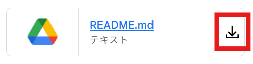

# Classroom MOD
## 概要
Google Classroomを使いやすくするための拡張機能です。
## 機能
- それぞれの機能のON/OFFは`content.js`の各変数を調整して下さい
  ```
  const replace_label = true; // 文章の短縮
  const direct_download = true; // 直ダウンロード
  ```
### 文章の短縮
- 横幅の小さいウインドウでClassroomのタイムラインを表示すると、「○○さんがさんが新しい資料を投稿しました」のような表示で文字が切れるため資料名が見えなくなる。名前を5文字までに短く表示し、文章を以下のように短縮して表示する。
  - 「ゆうきゆい-YukiYuiさんが新しい資料を投稿しました: <資料名>」→「ゆうきゆい…資料: <資料名>」
  - 「ゆうきゆい-YukiYuiさんが新しい課題を投稿しました: <課題名>」→「ゆうきゆい-…課題: <課題名>」
- 調整は`content.js`の各変数をいじってください
  ```
  const name_length = 5; // 名前の文字数
  const name_display = true; // 名前を表示するか
  const label_display = true; // ラベルを表示するか (資料: 課題: など)
  ```

### 直ダウンロード
- 資料横のダウンロードボタンを押すと、ページ移動せずに直接資料をダウンロードできる。
- ダウンロードボタン上で右クリックし、「新しいページで開く」を選ぶと、資料のダウンロードを待たずにほかの資料をダウンロードできる。


## インストール方法 (Google Chrome)
1. 任意のディレクトリに、リポジトリを[zipでダウンロード](https://github.com/Yuki-Yui/classroom-mod/archive/refs/heads/main.zip)するか ```git clone``` する
1. zipでダウンロードしたら任意の場所に展開（解凍）する
1. 拡張機能のページ(chrome://extensions/)に移動し、画面右上のデベロッパーモードをオン
1. 画面上部の「パッケージ化されていない拡張機能を読み込む」をクリックし、先ほどダウンロードしたフォルダを選択する
